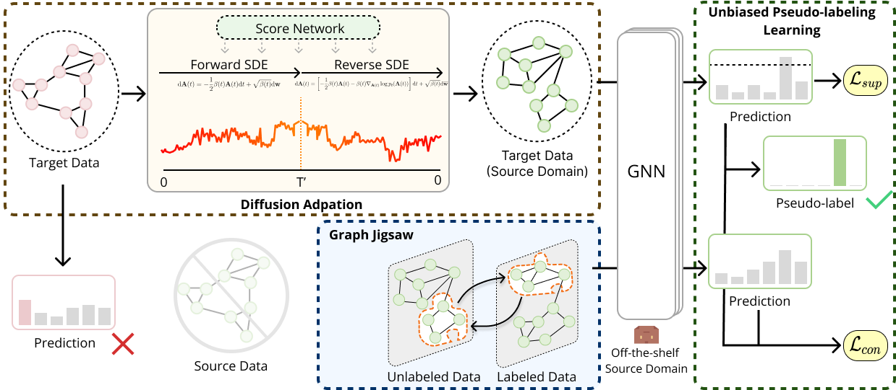

# GALA: Graph Diffusion-based Alignment with Jigsaw for Source-free Domain Adaptation

## TLDR

GALA, for the first time, investigate source-free graph-level domain adaptation. GALA address this question from a data-centric perspective, utilizing graph diffusion models and jigsaw techniques to align domains and enhance generalization without the access of source data.


## BibTex

If our work has been helpful to you, please consider citing it. It will be an encouragement for us.

```bibtex
@ARTICLE{gala2024,
    author={Luo, Junyu and Gu, Yiyang and Luo, Xiao and Ju, Wei and Xiao, Zhiping and Zhao, Yusheng and Yuan, Jingyang and Zhang, Ming},
    journal={ IEEE Transactions on Pattern Analysis & Machine Intelligence },
    title={ GALA: Graph Diffusion-based Alignment with Jigsaw for Source-free Domain Adaptation },
    year={2024},
    volume={},
    number={01},
    ISSN={1939-3539},
    pages={1-14},
    doi={10.1109/TPAMI.2024.3416372},
    month={June}
}
```



## Abstract

Source-free domain adaptation is a crucial machine learning topic, as it contains numerous applications in the real world, particularly with respect to data privacy. Existing approaches predominantly focus on Euclidean data, such as images and videos, while the exploration of non-Euclidean graph data remains scarce. Recent graph neural network (GNN) approaches could suffer from serious performance decline due to domain shift and label scarcity in source-free adaptation scenarios. In this study, we propose a novel method named Graph Diffusion-based Alignment with Jigsaw (GALA) tailored for source-free graph domain adaptation. To achieve domain alignment, GALA employs a graph diffusion model to reconstruct source-style graphs from target data. Specifically, a score-based graph diffusion model is trained using source graphs to learn the generative source styles. Then, we introduce perturbations to target graphs via a stochastic differential equation instead of sampling from a prior, followed by the reverse process to reconstruct source-style graphs. We feed them into an off-the-shelf GNN and introduce class-specific thresholds with curriculum learning, which can generate accurate and unbiased pseudo-labels for target graphs. Moreover, we develop a simple yet effective graph mixing strategy named graph jigsaw to combine confident graphs and unconfident graphs, which can enhance generalization capabilities and robustness via consistency learning. Extensive experiments on benchmark datasets validate the effectiveness of GALA.


## Code Usage

To implement a Graph Source-free Domain Adaptation process:
```python
python3 main.py --DS FRANKENSTEIN --data_split 4 --source_index 0 --target_index 2 --hidden-dim 64 --conv_type GCN --tta_epoch 20 
```

> Notes:
> - Pay attention to the density-based graph classification dataset splitting process in the Datasets section. The goal of Graph SFDA is to achieve transfer between different datasets.
> - For graph reconstruction using diffusion, refer to the code in the `diffusion` directory and replace `data`. Use the following command:
> ```python 
> python main.py --config configs/ENZYMES_0.py --mode train --workdir exp/ENZYMES
> ```


## Acknowledgement

- This repo is based on the repo [Score_SDE](https://github.com/yang-song/score_sde_pytorch) and [GraphGDP](https://github.com/GRAPH-0/GraphGDP). 

- Evaluation implementation is modified from the repo [GGM-metrics](https://github.com/uoguelph-mlrg/GGM-metrics).
